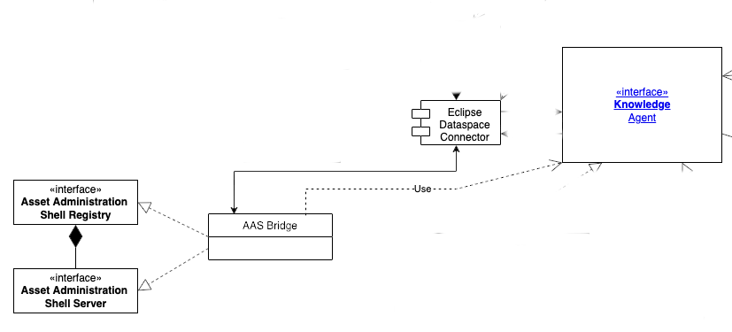

<!--
 * Copyright (c) 2022,2023 Contributors to the Eclipse Foundation
 *
 * See the NOTICE file(s) distributed with this work for additional
 * information regarding copyright ownership.
 *
 * This program and the accompanying materials are made available under the
 * terms of the Apache License, Version 2.0 which is available at
 * https://www.apache.org/licenses/LICENSE-2.0.
 *
 * Unless required by applicable law or agreed to in writing, software
 * distributed under the License is distributed on an "AS IS" BASIS, WITHOUT
 * WARRANTIES OR CONDITIONS OF ANY KIND, either express or implied. See the
 * License for the specific language governing permissions and limitations
 * under the License.
 *
 * SPDX-License-Identifier: Apache-2.0

-->

# Tractus-X Knowledge Agents AAS Bridges (KA-AAS) Documentation

In the [Knowledge Agent Architecture](architecture/Arc42.md), an Agent is any component which speaks and/or enacts a Semantic Web protocol, such as SPARQL.

According to AAS Part 1 & 2, an "Asset Administration Shell" (Server, Registry) is a component that allows to represent and query a source using a predefined REST Api.

Both Knowledge Agents as well as AAS components are expected to be compatible to the [Tractus-X EDC](https://github.com/eclipse-tractusx/tractusx-edc) connector.

A Bridge is a component which adapts the interface of one technology/standard (such as AAS) into the interface of the other (Knowledge Agent/Semantic Web).

See the [Knowledge Agents OpenAPI](https://github.com/eclipse-tractusx/knowledge-agents/blob/main/docs/api/openAPI.yaml) and the [Asset Administration Shell OpenAPI](https://github.com/admin-shell-io/aas-specs-api/blob/main/Entire-API-Collection/V3.0.yaml) for reference.

## How it works

### KA AAS Bridge

Currently we provide an AAS server/AAS registry interface that is backed by a one or several agents where the agents themselves could be Binding Agents or even Matchmaking Agents - see the [Knowledge Agent Architecture](architecture/Arc42.md) 

## NOTICE

This work is licensed under the [Apache-2.0](https://www.apache.org/licenses/LICENSE-2.0).

- SPDX-License-Identifier: Apache-2.0
- SPDX-FileCopyrightText: 2022,2023 T-Systems International GmbH
- SPDX-FileCopyrightText: 2022,2023 Contributors to the Eclipse Foundation
- Source URL: https://github.com/eclipse-tractusx/knowledge-agents
